# Tushare 股票数据获取示例设计文档

## 概述

本项目旨在提供一系列 Tushare 股票数据获取的实用示例，帮助用户快速上手使用 Tushare API 来获取股票基本信息、K线数据、财务数据等。Tushare 是一个免费的、开源的 Python 财经数据接口包，为用户提供了丰富的股票、基金、期货等金融数据。

### 项目目标
- 提供完整的 Tushare 使用示例
- 涵盖股票基本信息查询
- 演示 K线数据获取和可视化
- 展示财务数据分析方法
- 提供数据存储和处理最佳实践

## 技术栈

- **数据接口**: Tushare Pro API
- **编程语言**: Python 3.7+
- **数据处理**: pandas, numpy
- **数据可视化**: matplotlib, seaborn, plotly
- **数据存储**: SQLite/MySQL (可选)
- **配置管理**: python-dotenv

## 架构设计

### 系统架构图

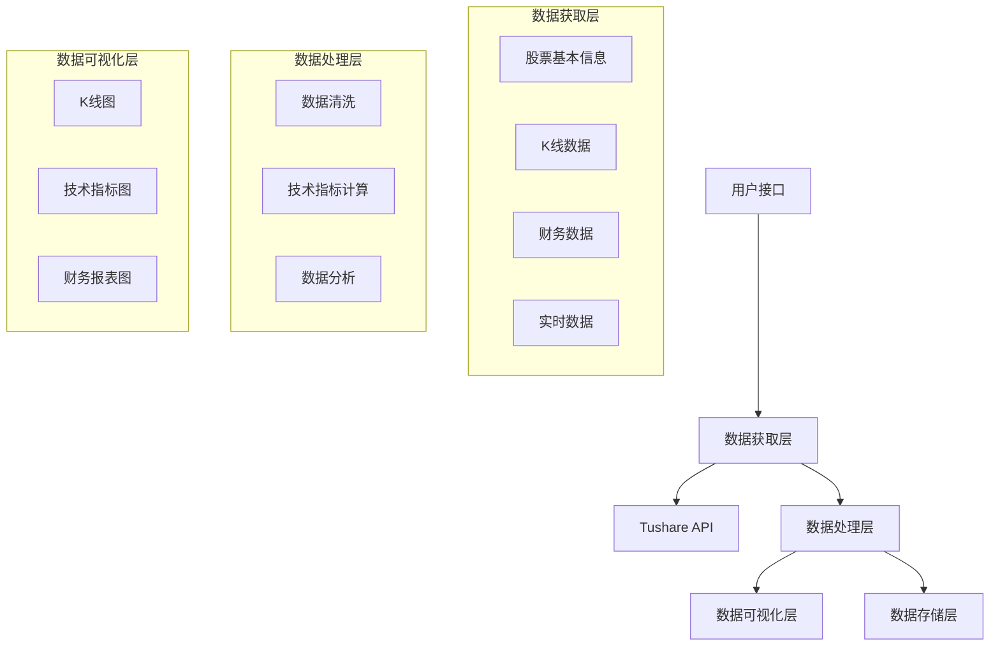

### 模块结构

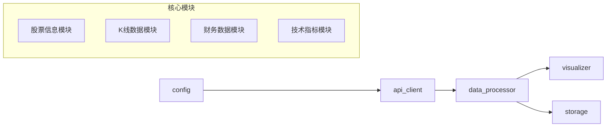

## 功能模块设计

### 1. 配置管理模块

#### 配置结构
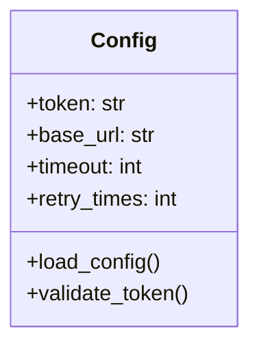

#### 功能特性
- API Token 管理
- 请求超时配置
- 重试机制配置
- 环境变量支持

### 2. 数据获取模块

#### API 客户端设计
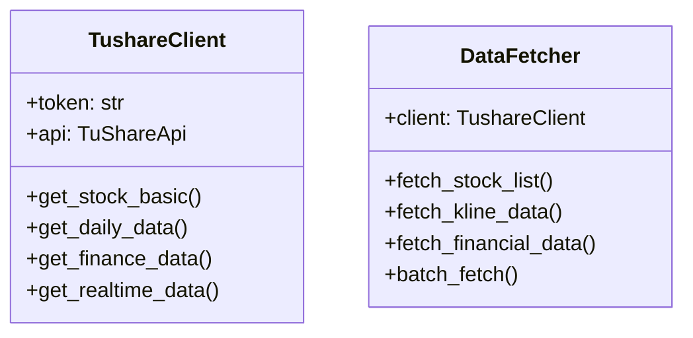

### 3. 股票基本信息模块

#### 数据结构
| 字段名 | 类型 | 描述 |
|--------|------|------|
| ts_code | str | 股票代码 |
| symbol | str | 股票简称 |
| name | str | 股票名称 |
| area | str | 地域 |
| industry | str | 所属行业 |
| market | str | 市场类型 |
| list_date | str | 上市日期 |

#### 核心功能
- 获取全部股票列表
- 按条件筛选股票
- 股票基本信息查询
- 行业分类查询

### 4. K线数据模块

#### 数据模型
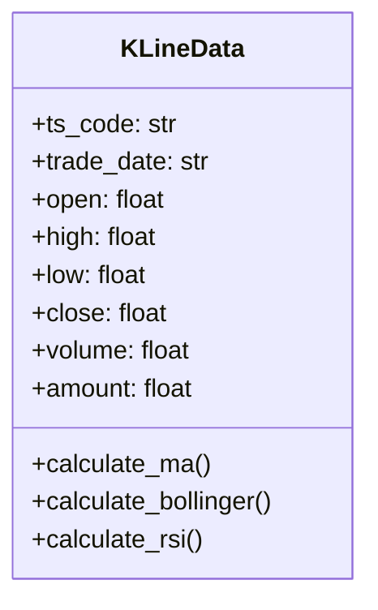

#### 支持的K线类型
- 日K线 (daily)
- 周K线 (weekly)
- 月K线 (monthly)
- 分钟级K线 (1min, 5min, 15min, 30min, 60min)

#### 技术指标计算
- 移动平均线 (MA)
- 布林带 (Bollinger Bands)
- 相对强弱指数 (RSI)
- MACD指标
- KDJ指标

### 5. 财务数据模块

#### 财务报表类型
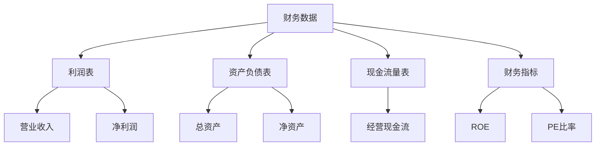

### 6. 数据可视化模块

#### 图表类型支持
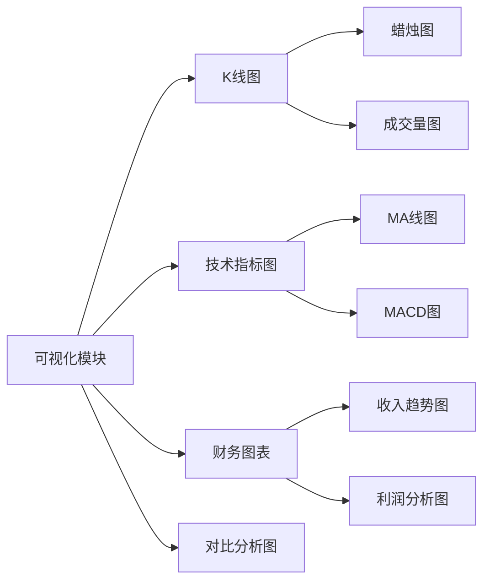

#### 交互功能
- 缩放和平移
- 数据点悬停显示
- 时间范围选择
- 多股票对比
- 导出图片功能

### 7. 数据存储模块

#### 存储策略
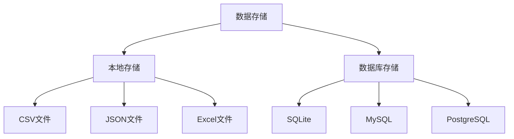

#### 数据表设计
- stock_basic: 股票基本信息表
- daily_data: 日线数据表
- financial_data: 财务数据表
- technical_indicators: 技术指标表

## 示例用例设计

### 1. 基础股票信息查询

#### 用例流程
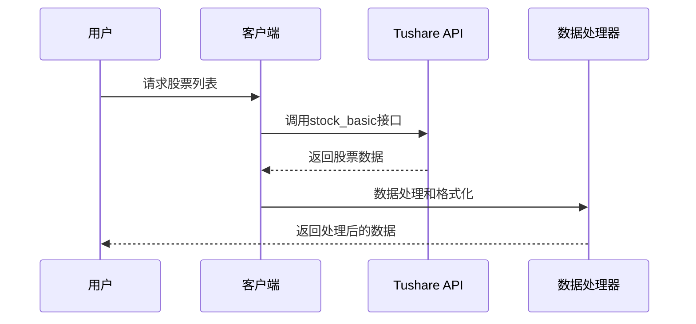

### 2. K线数据获取与可视化

#### 数据流程
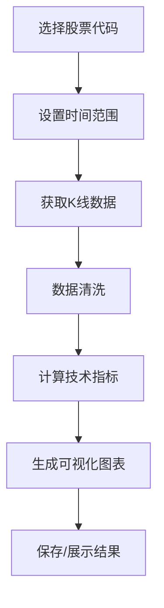

### 3. 批量数据分析

#### 处理流程
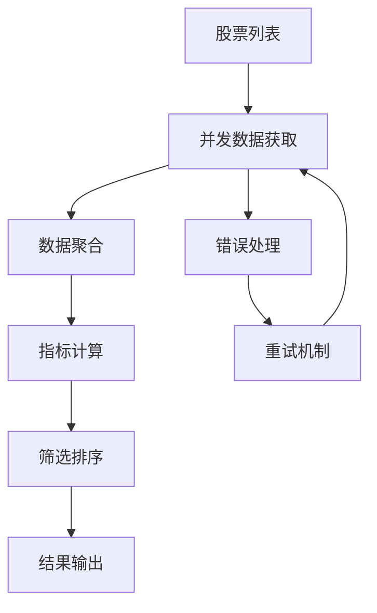

## 核心示例场景

### 场景1: 获取指定股票的基本信息
- 输入股票代码或名称
- 查询股票基本信息
- 展示公司基本面数据

### 场景2: 绘制股票K线图
- 选择股票和时间周期
- 获取历史K线数据
- 添加技术指标
- 生成交互式图表

### 场景3: 财务数据分析
- 获取财务报表数据
- 计算财务比率
- 生成财务分析报告
- 可视化财务趋势

### 场景4: 股票筛选器
- 设置筛选条件
- 批量获取股票数据
- 应用筛选算法
- 输出符合条件的股票

### 场景5: 实时数据监控
- 订阅实时数据推送
- 数据实时更新
- 异常监控告警
- 数据持久化存储

## 错误处理策略

### 异常类型处理
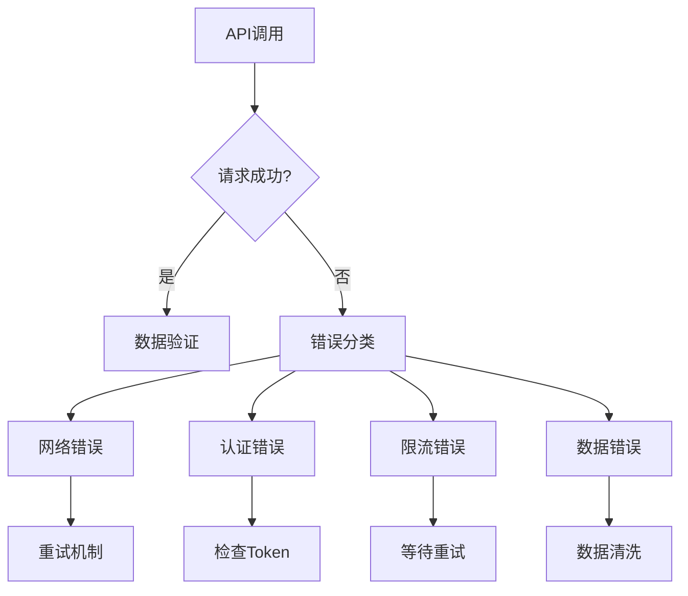

### 重试机制
- 指数退避策略
- 最大重试次数限制
- 不同错误类型的处理策略
- 失败后的降级方案

## 性能优化

### 数据获取优化
- 批量请求减少API调用次数
- 数据缓存机制
- 增量更新策略
- 并发控制

### 内存管理
- 大数据集分片处理
- 及时释放不用的数据
- 使用生成器减少内存占用
- 数据压缩存储

### 可视化性能
- 数据抽样显示
- 懒加载机制
- 图表缓存
- 渲染优化

## 扩展性设计

### 插件架构
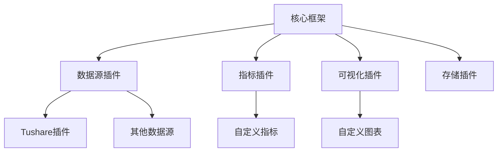

### 配置化支持
- 数据源配置化
- 指标计算配置化
- 图表样式配置化
- 输出格式配置化